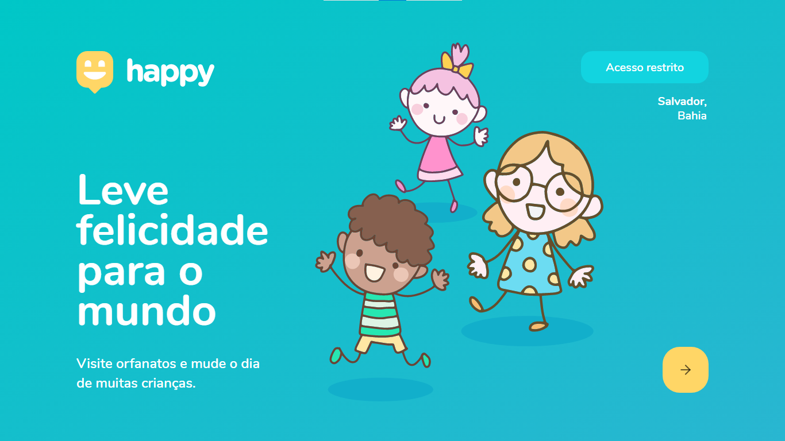
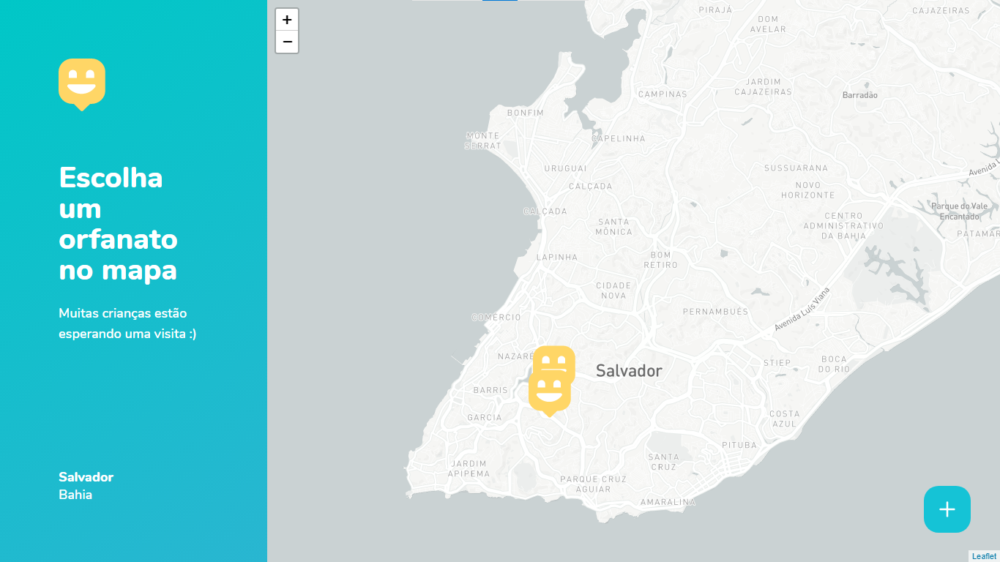
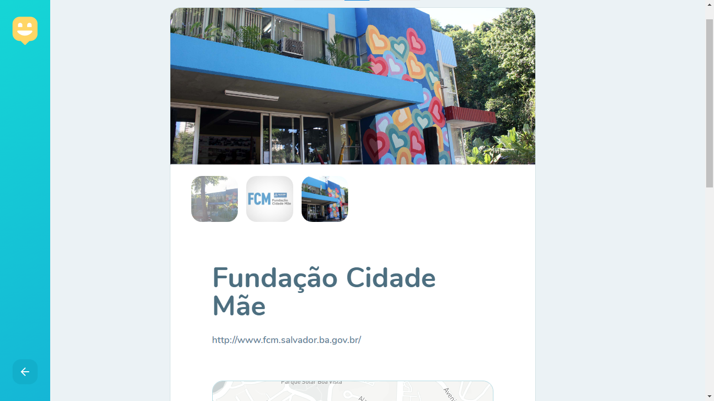
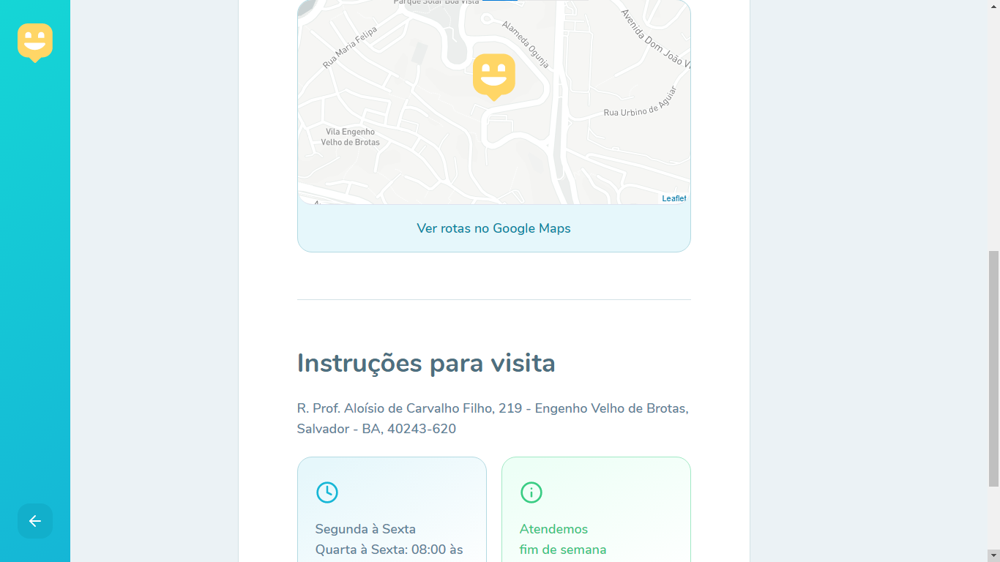
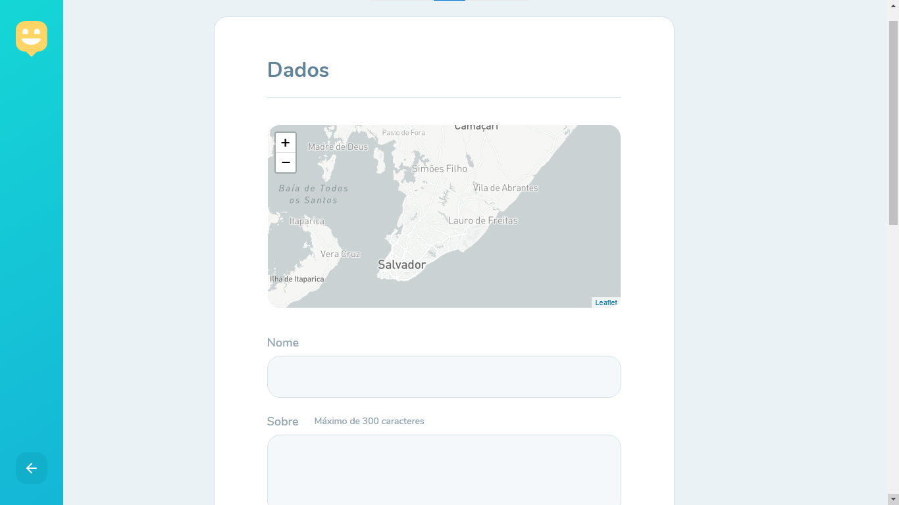
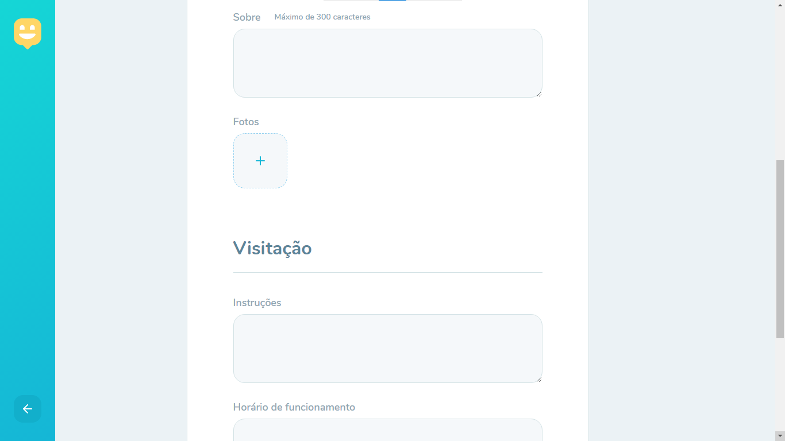
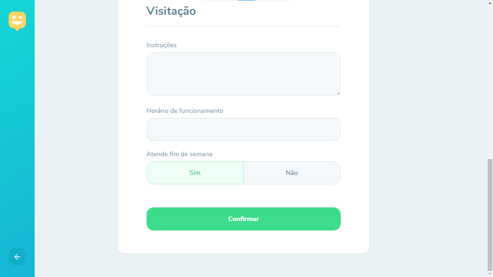

<h1 align='center'>Happy - NLW#3 - v1.0</h1>

<h3>🔖 Descrição</h3>

Projeto desenvolvido na semana da #Next Level Week da Rocketseat.

<h3>🚀 Tecnologias</h3>
<ul>
    <li><h4>React</h4></li>
    <li>
React Route
</li>
    <li>
React Native
</li>
    <li>
JavaScript
</li>
    <li>
CSS
</li>
</ul>

<h3>ℹ️ Como usar</h3>

    # Clone esse repositório
    $ git clone https://github.com/juvenalbruno/NLW_03
    
    # Instalar dependências do projeto
    $ npm install
    
    # Executar o comando para rodar o projeto
    $ npm start

<h3>🖼 Layout</h3>
<h4>Janela inicial</h4>

 
<h4>Janela Home/Mapa</h4>

 
<h4>Janela de Visualização (Exemplo)</h4>

  
<h4>Janela de Visualização (Exemplo)</h4>

 
<h4>Janela de cadastro do Orfanato</h4>

 
<h4>Janela de cadastro do Orfanato</h4>

 
<h4>Janela de cadastro do Orfanato</h4>

